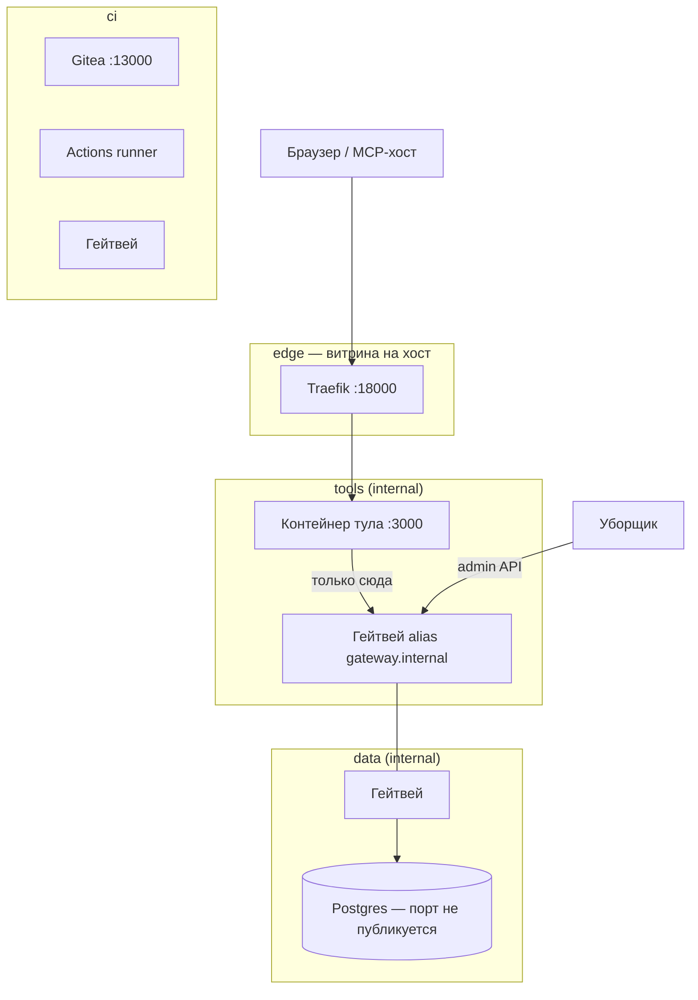
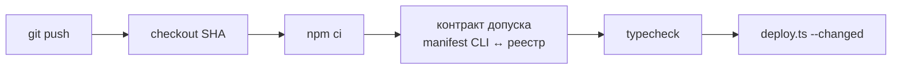
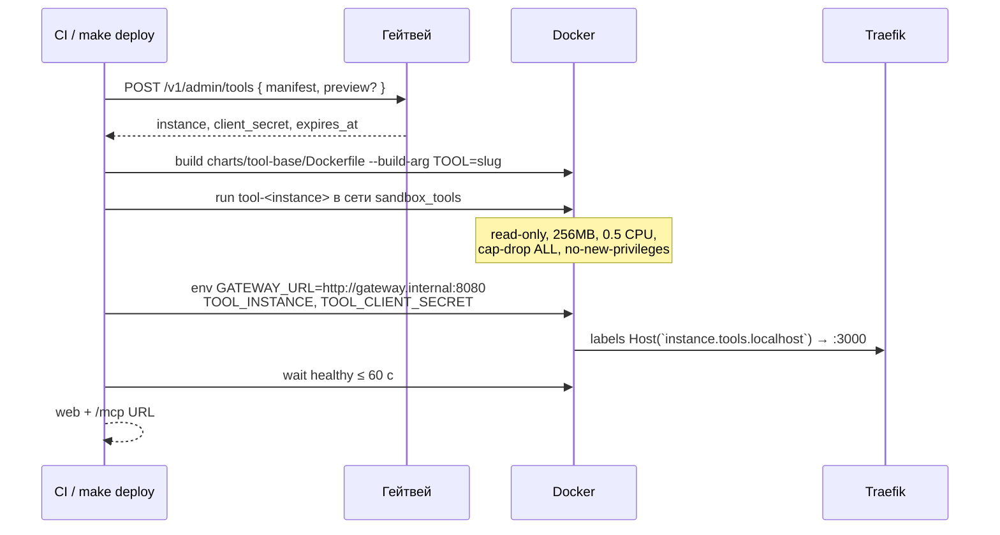
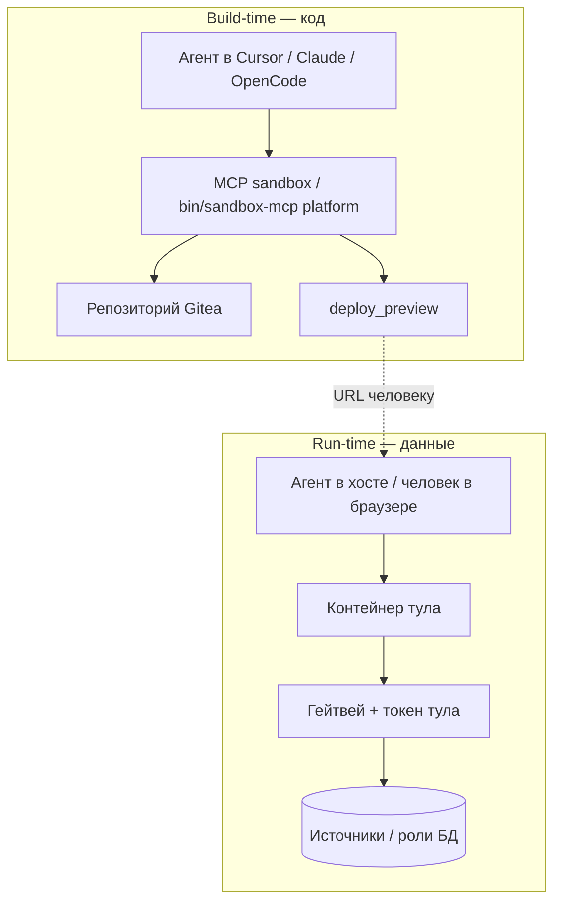
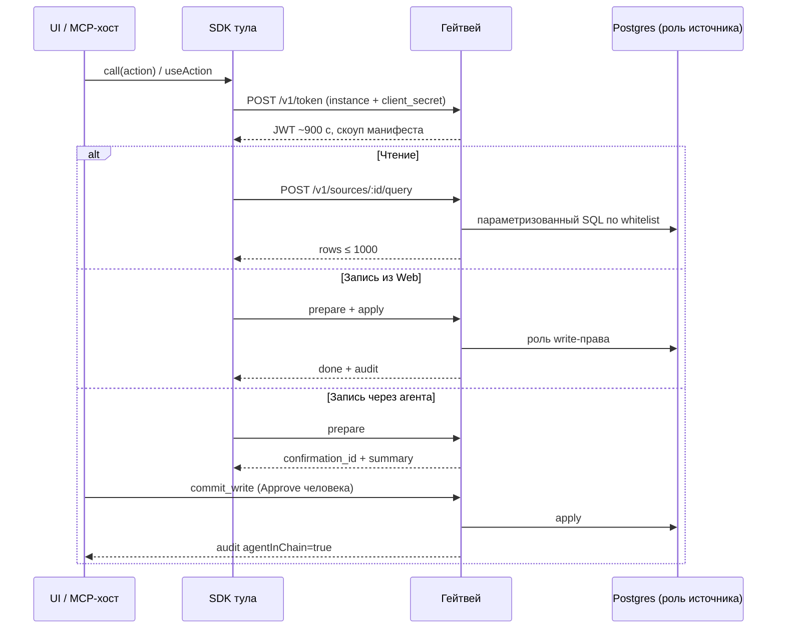

# Песочница внутренних тулов

**Бриф для обсуждения с коллегами** · архитектура развёртывания и взаимодействия

Факты ниже — с локального стенда Compose (`docker-compose.yml`, `charts/tool-base/deploy.ts`, `.gitea/workflows/tools.yml`, `gateway/`). Kubernetes — вне текущей итерации; целевая изоляция в проде та же по смыслу (NetworkPolicy вместо compose-сетей).

---

## Тезис

Узкое место — не код агента, а **контур, в котором коду разрешено работать с данными**.  
Согласовываем контур один раз; каждый тул проходит машину: манифест → CI → контейнер → превью → merge.  
Человек решает в двух точках (реестр и превью/PR). Обход гейтвея закрыт **сетью**, а не соглашением.

---

## 1. Проблема

Одноразовые внутренние инструменты (сверка, админка под процесс, гипотеза) либо не делаются, либо проходят продуктовый цикл и стоят дороже проблемы.

| Тип | Продуктовый цикл (оценка) | Песочница (оценка) |
| --- | ---: | ---: |
| Сверка | ~20 дней | ~1 день |
| Админка | ~45 дней | ~2 дня |
| Гипотеза | ~30 дней | ~1 день |

*Порядок величины для обсуждения, не SLA.*

---

## 2. Изоляция: четыре сети

| Сеть | Кто | Факт |
| --- | --- | --- |
| `data` internal | Postgres, гейтвей | БД с хоста не видна; консоль — `make psql` |
| `tools` internal | Тулы, гейтвей, Traefik | У тула нет маршрута никуда, кроме этой сети |
| `edge` | Traefik → хост | `*.tools.localhost:18000` |
| `ci` | Gitea, runner, гейтвей | CI деплоит без egress тула в интернет |

**Нет стрелки тул → Postgres.** Гейтвей сидит на стыке `data` + `tools`.

### Порты стенда

| Сервис | Порт |
| --- | --- |
| Витрина / тулы (Traefik) | 18000 |
| Гейтвей (с хоста) | 18080 |
| Gitea | 13000 (SSH 12222) |
| Postgres | не публикуется |

---

## 3. Разворачивание тула

Единственный способ выкатки — `charts/tool-base/deploy.ts` (из CI или `make deploy TOOL=…`).  
Тул **не** пишет Dockerfile, compose и сетевые правила.

### Конвейер CI

Файл: `.gitea/workflows/tools.yml` · на каждый push в любую ветку:

- Красный контракт или типы → деплоя нет, мерж в `main` блокируется.
- Checkout из самой Gitea (без зависимости от github.com).

### Что делает `deploy.ts` по шагам

| # | Шаг | Деталь |
| --- | --- | --- |
| 1 | Регистрация | Гейтвей валидирует `tool.yaml`, создаёт инстанс, выдаёт секрет |
| 2 | Образ | Общий Dockerfile каркаса, аргумент `TOOL=<slug>` |
| 3 | Контейнер | Только `sandbox_tools`; read-only FS; лимиты CPU/RAM/pids |
| 4 | Роутинг | Traefik label → `<instance>.tools.localhost:18000` |
| 5 | Health | До 60 с ожидания; иначе логи и fail CI |

### Прод vs превью

| | Прод (`main`) | Превью (ветка) |
| --- | --- | --- |
| Имя инстанса | `manager-board` | `manager-board--feature-x` |
| URL | `http://manager-board.tools.localhost:18000` | `http://manager-board--feature-x.tools.localhost:18000` |
| Что деплоится | Все тулы | Только затронутые в diff; если менялись `packages/` или `charts/` — все тулы |
| TTL | из `tool.yaml`, потолок `max_ttl_days: 90` | ≤ 7 дней |
| MCP | `…/mcp` | тот же путь на превью-хосте |

### Защита `main`

Прямой пуш запрещён всем (включая admin из `.env` по правилам стенда).  
Путь: ветка `sandbox-agent` → CI превью → PR → одобрение **человека** (`GITEA_HUMAN_USER`) + зелёный CI → merge → прод.  
Новые коммиты сбрасывают approve. Пароль human-user **не** лежит в `.env` — агент не может сам смержить.

---

## 4. Взаимодействие

### Два типа агентов (права не смешиваются)

| | Build-time | Run-time |
| --- | --- | --- |
| MCP | `sandbox` (платформа) | `sandbox-<тул>` |
| Права на данные | нет | только скоуп манифеста |
| Реестр / gateway / packages | нельзя менять из задачи про тул | не видит |
| Запись | — | prepare; commit — человек |

### Build-time: шесть инструментов платформы

| Инструмент | Роль |
| --- | --- |
| `list_sources` | Одобренные источники, поля, writes |
| `scaffold_tool` | Скелет `tools/<slug>` + `make agents` |
| `validate_manifest` | Проверка до коммита |
| `deploy_preview` | Force-push в `preview/<name>` → ждёт CI → URL |
| `get_logs` | Логи контейнера и прогона CI |
| `open_pull_request` | PR на `main` после превью |

Цикл: `list_sources → scaffold → validate → commit → deploy_preview → (человек) → open_pull_request`.

Без агента те же вызовы: `node infra/demo/sandbox-call.ts <инструмент> '<json>'`.

### Run-time: два фасада, один бэкенд

| Фасад | URL | Запись |
| --- | --- | --- |
| **Web** | `http://<instance>.tools.localhost:18000` | Человек → apply сразу |
| **MCP App** | `http://<instance>.tools.localhost:18000/mcp` | Агент prepare → человек Approve `commit_write` |

UI общий (Preact + `@sandbox/ui-kit`). Меняется только отдача: страница vs `ui://` в хосте агента.  
Claude Desktop: мост `infra/mcp-bridge.ts` (stdio ↔ HTTP), логин человека последним аргументом.

### Цепочка данных в рантайме

Политика токена: `token_ttl_seconds: 900`. Передеплой выдаёт новый секрет — старые токены отзываются.

---

## 5. Гейтвей: поверхность API

| Эндпоинт | Назначение |
| --- | --- |
| `GET /v1/registry` | Реестр источников и writes |
| `POST /v1/admin/tools` | Регистрация инстанса при деплое |
| `GET /v1/admin/tools` | Список инстансов (уборщик, портал) |
| `POST /v1/token` | JWT под инстанс |
| `POST /v1/sources/:source/query` | Чтение |
| `POST /v1/writes/:write/prepare` | Подготовка записи |
| `POST /v1/writes/:write/apply` | Немедленная запись (UI) |
| `POST /v1/writes/confirmations/:id/commit` | Подтверждение человеком |
| `POST /v1/lifecycle*` | TTL-баннер, продление/удаление владельцем |

**Чтение:** идентификаторы таблиц/полей только из реестра; where: `eq|ne|gt|gte|lt|lte|in|contains`; без JOIN/OR/агрегатов.  
**Запись:** именованная операция из реестра + отдельная минимальная роль БД + `describe`/`apply` в гейтвее — не generic CRUD «в любую таблицу».

Контракт тула (`tool.yaml`): `owner`, `ttl_days`, `sources[]`, `writes[]`, `ui.mode: [web, mcp-app]`.

---

## 6. Жизненный цикл

| Параметр | Значение на стенде |
| --- | --- |
| Продление использованием | только вызовы **человека**; на `ttl_days`, не дальше `max_ttl_days` (90) от явного продления |
| Простой | `idle_days: 30` → notice владельцу |
| После notice | `idle_grace_days: 7` → удаление |
| Уборщик | раз в минуту: `sweep-idle` + `docker rm` контейнера и образа |
| Ручной отзыв | `make revoke TOOL=…` → гейтвей 403, reaper ≤ ~30 с |

Портал `http://tools.localhost:18000` — тулы, сроки, ветки, PR (только чтение статуса).

---

## 7. Безопасность: карта угроз

| Угроза | Контрмера |
| --- | --- |
| Тул → Postgres напрямую | Сеть `tools` ≠ `data`; в SDK нет драйвера; CI режет запрещённые зависимости |
| Чужой источник в манифесте | `packages/manifest` в CI до деплоя |
| SQL-инъекция | Whitelist + параметры (`make demo-gateway` ловит) |
| Агент сам подтверждает запись | `commit_write` только от человека → отказ + аудит |
| Вечный тул | TTL + reaper удаляет контейнер и образ |
| Секреты источников в туле | `password_env` только у гейтвея; тулу — `client_secret` инстанса |
| Агент мержит в `main` | Branch protection; пароль human-user не в `.env` |
| Раздувание скоупа токена | JWT = манифест ∩ реестр, короткий TTL |

**Сдвиг для ИБ:** согласование один раз на источник/write в реестре, а не на каждый тул.

---

## 8. Чем песочница не является

| Неверное прочтение | Почему не так |
| --- | --- |
| Dev-стенд | Не копия прода; своя нагрузка и свои пользователи |
| Внутренний PaaS | Намеренно один каркас и один выход к данным |
| «Агенту открыли БД» | У агента нет маршрута к БД; только тул → гейтвей |
| Ускоренный продуктовый релиз | Отдельный регламент допуска и смертность тулов |

---

## 9. Что просим у коллег

1. **Рамку** — отдельный контур допуска, не ускорение основного релиза и не прямой доступ агента к данным.
2. **Реестр** — новые источники и writes остаются решением ИБ/владельца данных.
3. **Инвестиции в гейтвей** — расширение адаптерами и declarative CRUD без ослабления сетей, confirm и аудита.

---

## Коротко для слайда

> Push → контракт → контейнер только в `tools` → Traefik.  
> Данные только через гейтвей под манифест.  
> Web пишет сразу; агент — только после Approve человека.  
> Превью на ветке, прод после PR человека.  
> Нет заходов — уборщик удаляет контейнер.

---

*Источник фактов: README, AGENTS.md, docker-compose, deploy.ts, gateway API, registry policy.*
